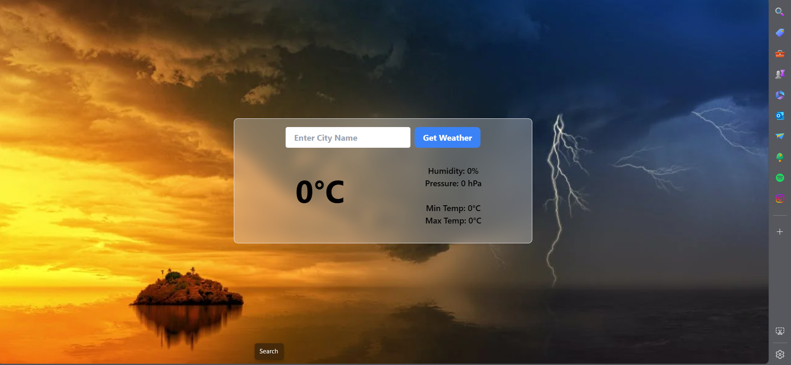
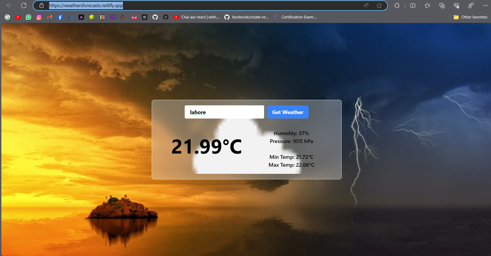
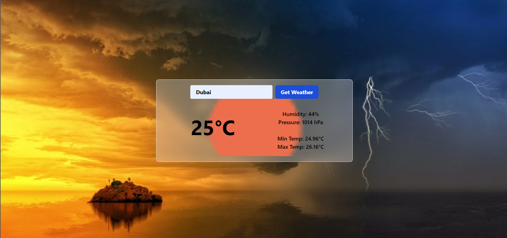

# Professional Weather Forecast Application


Welcome to the Weather Forecast App, a sophisticated web application meticulously crafted by Abdulmehad. This cutting-edge application seamlessly integrates with React and Tailwind CSS, offering users a refined and visually captivating experience. Providing real-time weather forecasts through an API, the Weather Forecast App stands as a testament to Abdulmehad's commitment to delivering accuracy and style in weather information presentation.

## Key Features

- **Real-time Weather Forecasts:** The application employs a robust API to fetch and deliver the latest weather data, ensuring users receive accurate and up-to-the-minute information.

- **Weather Forecast Symbol:** Experience a visually immersive forecast presentation as the app dynamically showcases background visuals representing the current weather conditions.

## Usage
1. To see the Live demo of app, follow this Link

   ```shell[
   https://passwordgeneratorrrrrr.netlify.app/
   ```
   To access the Weather Forecast App, simply visit the [live website](https://weathersforecasts.netlify.app/). Write the name of the city you want to find the weather of, On the screen, you'll find details such as the current temperature, weather conditions, and an aesthetically pleasing forecast symbol.

## Installation

1. Clone the repository:

   ```shell
   git clone https://github.com/Abdulmehad/PasswordGeneartorinReact.git
   ```

2. Navigate to the project directory:

   ```shell
   cd PasswordGeneartorinReact
   ```

3. Install the dependencies:

   ```shell
   npm install
   ```

## Technology Stack

The Weather Forecast App is constructed using state-of-the-art technologies:

- **React:** The app's dynamic and responsive user interface is developed using React, ensuring a seamless and interactive user experience.

- **Tailwind CSS:** Tailwind CSS is employed to style the application, resulting in an elegant and visually appealing design that aligns with modern web development standards.

- **JavaScript:** The app leverages JavaScript to efficiently interact with the API, retrieve real-time weather data, and dynamically update the user interface with the latest forecast information.

- **API Integration:** The application seamlessly integrates with an external API to fetch and present weather data in real-time. The specific API utilized may vary based on the implementation.

## Screenshots

### City 1


### City 2


## Contact

For inquiries, feedback, or any assistance regarding the Weather Forecast App, please feel free to reach out to Abdulmehad at abdulmehad@gmail.com. As a seasoned software engineer, Abdulmehad has meticulously developed this app with a dedicated focus on delivering a seamless and reliable weather forecasting experience.
